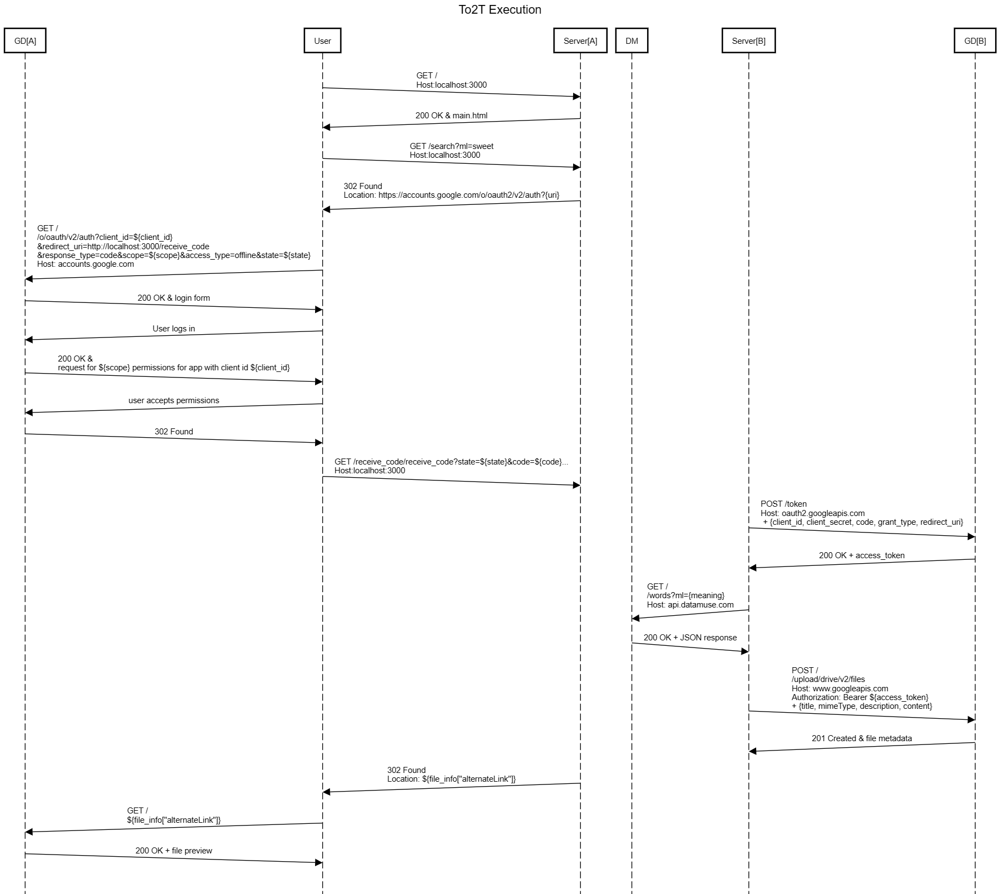

# Queens College CSCI370 Final Project - Tip of the Tongue (To2T)
**Author**: Luiz Felipe Coelho Lemos
**Completed**: December 28, 2023
**Professor**: Raymond Law

## What Does it Do?
"Tip of the Tongue" is a personal experiment in learning to interacting multiple RESTful APIs in a synchronous manner; in this case, the APIs are the DataMuse and Google Drive APIs. As a premise, the app allows the user to type any word into the search bar and a json file containing a set of close synonyms will be saved into the users Google Drive account.

## How Does it Work?
The sequence of HTTPS messages and response is explained in the diagram below

